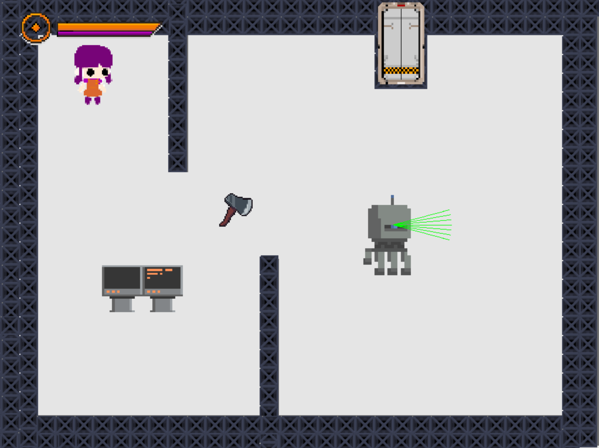
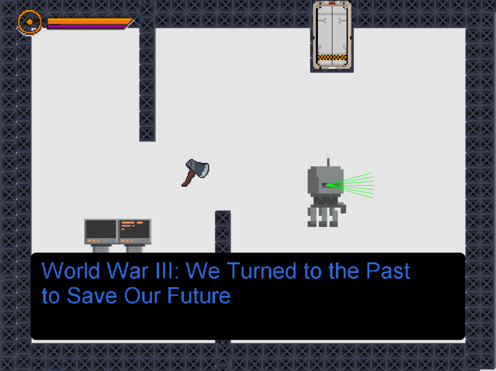

# Reem
World War III: We Turned to the Past to Save Our Future

2219 was a year of doom for humanity: the World War III plunged the planet Earth into chaos, turning everything on its path to fire. The threat came from the unexpected, the backbone of our society - our machines, and they did not intend to show any mercy to their creators. For some time, it seemed like humanity had no chance of survival. Luckily, our adaptiveness, the same skill that let us rampage through evolution, stroke again…

Humans managed to master weapons that were gathering dust on the shelves of history for centuries - axes, trebuchets, swords, and many more…

---

Play the action RPG set in the dystopian future to decide the fate of your main character Reem, girl who was kidnapped by robots to be experimented upon.

## Screenshots

## Demo

